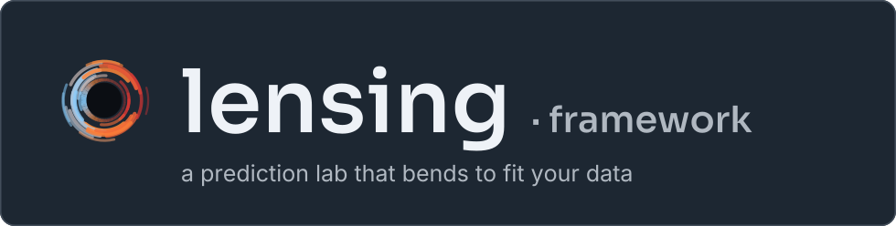

<p align="center"></p>

<p align="center">
<b>What should play next?</b><br>
A research lab that learns one listener's sessions from their Spotify history and
predicts the next track: a song that fits the mood, isn't just the same artist
again, and still sounds like what they actually picked.<br>
Built on <a href="https://github.com/egonik-unlp/lensing">lensing</a>, with its
full experimental record and a live showcase app.
</p>

<p align="center">
<a href="#the-question">the question</a> ·
<a href="#what-won">what won</a> ·
<a href="#what-didnt">what didn't</a> ·
<a href="#the-record">the record</a> ·
<a href="#infinite-playlist-the-showcase">the showcase</a> ·
<a href="#run-it">run it</a> ·
<a href="docs/REFERENCE.md">reference</a>
</p>

> **This is a lensing instance, not the framework.** [lensing](https://github.com/egonik-unlp/lensing)
> is a general prediction lab you set up for your own data. This repo is one
> copy of it, set up for next-track recommendation on a single Spotify
> listening history. It holds the corpus pipeline, the sequence predictors
> written for this problem, 31 campaign reports and the models that came out of
> them. For the general framework, see the mother repo.

## The question

Given a listening **session** (the ordered tracks played so far), rank the
library and recover the **next distinct track** the listener played.

| | |
|---|---|
| **corpus** | an *Extended streaming history* Spotify export, split into sessions (30-min gap, <30 s plays count as skips), enriched through the Spotify Web API and embedded into Qdrant (`spotify_tracks`, then the `_content` / `_song_ae` autoencoder chain) |
| **split** | leak-free and chronological: 7,154 sessions, 19,402 library tracks; 5,723 train / 1,431 test sessions, cut on 2024-08-24; **55% of test items never appear in training** |
| **item space** | PCA-192 over the content embedding (a sweep found that the latent **dimension** mattered, not the choice of compressor) |
| **ranking metrics** | Recall@10, MRR, hit@10, plus partial-credit metrics: `artist@10`, `genre@10` and `music@10` (how close the top 10 sounds to the true next track) |
| **main metric** | **holisticness@10** = mood coherence × list diversity × (1 − artist eagerness) × musical relevance |

The main metric exists because exact recall rewards the wrong behavior. The
most accurate models turned out to be the most **artist-eager**: they fill the
top 10 with the seed artist again. Holisticness@10 scores sessions that keep
the mood, vary the artists and still sound like the real continuation. Its
relevance factor was added after the first, three-factor version was shown to
reward pleasant music unrelated to the session. Holisticness is never read
without a **recall floor**, because a model can raise it by predicting worse.

Everything above is set in [`domain.toml`](domain.toml), the instance's single
source of domain truth.

## What won

The results in this section are specific to this instance; the framework repo
has no equivalent. The full tables, CIs and run ids are in
[`experiments/PROJECT-FACTS.md`](experiments/PROJECT-FACTS.md).

### Exact next track: Recall@10 on 1,431 held-out sessions

| model | Recall@10 | MRR | status |
|---|---|---|---|
| first-order **Markov** co-listening (the bar) | 0.107 | 0.069 | baseline |
| **R+M**: session GRU × Markov z-blend (AE-64) | 0.173 | 0.096 | 3-seed confirmed |
| **R+M+C**: + content-kNN leg (PCA-192) | 0.186 | 0.103 | promoted: `blend-gru-markov-content` |
| **R′+M+C′**: GRU and content legs retrieved through a learned projection (InfoNCE) | **0.212** | **0.122** | **champion**, promoted: `blend-gru-markov-content-proj`; seed-robust, and confirmed on a second disjoint split |
| R′+M+C′ + **`markov_gate`** (the Markov leg abstains when it has no bigram evidence) | **0.232** | **0.134** | best recall on record; paired Δ CI>0 on two splits; not yet promoted |

The key result is **rank fusion**. A session GRU alone only *ties* the
Markov bar. The GRU and Markov legs get *different* tracks right, so a
simple z-score blend beats the bar by about 60%. Content is the one leg
that adds new signal, and a learned linear map of the content space toward
"what follows what" is what moved the champion.

### Holisticness@10 board

| model | H@10 | Recall@10 | note |
|---|---|---|---|
| single GRU + **MMR re-rank** λ 0.7 / pool 50 | 0.0304 | 0.120 | best arm that costs no recall; registered |
| champion + `markov_gate` + **MMR** λ 0.7 / pool 200 | **0.0310** | **0.213** | same recall as the champion at ~3.6× its H; waiting for approval to promote |

The **MMR re-rank at evaluation time** is the first confirmed way to raise
holisticness. It is nearly free with the gate on, and costs recall without it.

## What didn't

Most campaigns ended in a null result, and those results are recorded like the
wins. Each one below is a closed question with a report behind it.

- **Learned combiners** (an XGBoost stacker, a jointly trained dual-tower
  GRU, …): four independent nulls against the fixed z-blend.
- A **per-step pre-encoder** in front of the recurrence actively *hurts*
  (−0.014 Recall@10, CI<0). A counterfactual read traced the loss to half-wave
  rectification deleting exactly the negative half of a zero-centered latent.
- **Depth** (stage-stack topologies) and **parallel tower banks** (N GRUs): both
  closed on both evaluation surfaces.
- A **training-time anti-eagerness regularizer**, tested at a calibrated
  margin: refuted, with a mechanism.
- **LSTM long memory** for holding a mood across a generated walk: refuted on
  its own decisive test (the GRU holds the vibe better in all four cells).
- **Dropout** on the deployed tower pair: a positive recall effect is
  *excluded*. As a side effect, the campaign produced the family's first
  seed-variance measurement.

That last point matters for reading the record. At n = 1,431 the paired CI on
Recall@10 is about ±0.012 wide, while a whole architecture family spans only
about 0.028. So the leaderboard can separate **policies and families**, but not
neighboring architectures. The instance's second evaluation surface is the
**walk**: autoregressive 20-step journeys scored on vibe, drift, genre breadth
and stride (`tools/walk_*.py`). It exists because a one-shot metric can't see
whether a generator holds a mood over time.

## The record

<p align="center"></p>

The campaign reports are primary; everything else is derived from them.

| | |
|---|---|
| **[`docs/experiments.pdf`](docs/experiments.pdf)** | **The whole experimental series as one living LaTeX report**: theory, every campaign, results tables, heatmaps for 2-D scans, leaderboards and conclusions. It covers both the earlier *rotation* (taste-fit) line and the next-track line. Spanish mirror: [`docs/experiments.es.pdf`](docs/experiments.es.pdf). |
| [`docs/next-track.pdf`](docs/next-track.pdf) | The next-track campaigns alone, from the Markov bar to the fusion champion, the holisticness crown and the walk surface. Spanish: [`docs/next-track.es.pdf`](docs/next-track.es.pdf). |
| [`experiments/*.md`](experiments/) | 31 dated campaign reports (+ `archive/`), each with a pre-registered decision rule, run ids and a verdict. The newest report wins. |
| [`experiments/PROJECT-FACTS.md`](experiments/PROJECT-FACTS.md) | The running summary: best on record, noise bands, pitfalls, dataset lineage, follow-ups. Agents read it first and update it after every campaign. |
| other notes in `docs/` | taste profile, SAE interpretability note, taste read from SAE atoms, model comparison (several with Spanish versions) |

The four main PDFs are kept in lockstep by the `report-curator` skill from one
shared [`docs/figures/make_figures.py`](docs/figures/make_figures.py). Ask for
"sync the experiment PDFs" after a campaign and they are rebuilt with `tectonic`.

<details>
<summary>where this instance came from</summary>

The lab started on a different question: can a track's *intrinsic metadata*
predict how much the listener engages with it (and later, whether it earns a
repeat play, `play_count ≥ 2`, scored by AUC)? Gradient-boosted trees over
artist/genre identity won that line (`xgboost-classifier-rotation`, AUC
0.7429). A chronological split then showed the leaderboard was an upper bound on
forward prediction (AUC 0.735 → 0.619). On 2026-07-12 the instance pivoted to
next-track recommendation. The rotation-era facts are preserved in
`experiments/INHERITED-rotation-PROJECT-FACTS.md` and the first half of
`docs/experiments.pdf`.

</details>

## Infinite Playlist: the showcase

[`clients/infinite-playlist/`](clients/infinite-playlist/) is how this lab's
models reach a listener. It is a **lensing showcase**: a standalone Cloudflare
Worker app built on the framework's `/showcase` path, where a promoted model is
exported to ONNX and runs in the browser through onnxruntime-web.

Seed it with any songs, albums or whole playlists (browse your own Spotify
account, or paste a link) and it plays an endless journey **through your own
library**. The model predicts the next latent, the app retrieves the nearest
unplayed library track, appends it and feeds the sequence back in, indefinitely.
It is a real model generating a sequence, not a similarity lookup.

- **Engines from the record.** *Balanced* (the dual-tower GRU, the default) was
  chosen over the *Original* single GRU by a paired head-to-head on the walk
  surface. The two *research arms* are shipped deliberately so the walk metrics
  can be **judged by ear**, with each arm's measured verdict shown verbatim
  under the picker.
- **Cold start for songs you don't own.** A Rust→WASM projector in the Worker
  places an out-of-vocabulary track in the model's own latent space (Spotify
  metadata + acoustics → bge-m3 embedding → PCA-192 seed latent).
- **Full-track playback** through the Web Playback SDK for Premium accounts
  (30 s previews otherwise), and **Save to Spotify** to turn a journey into a
  real playlist.

Its development bench is **[`clients/playlist-lab/`](clients/playlist-lab/)**,
served by the running server at `http://localhost:8096/lab`. It runs session
generators side by side on the same seed and policy through
`POST /api/models/{name}/extend`. See the showcase's own
[README](clients/infinite-playlist/README.md) for deploys, preview aliases and
asset rebaking.

## Run it

```sh
zig build db-up            # Postgres (:5437) + this instance's Qdrant (:6337)
zig build serve            # build backend + UI, serve on http://localhost:8096
```

Or run the whole instance in containers with `zig build docker-serve` (see
[`deploy/README.md`](deploy/README.md)). The Python sequence predictors run in
`predictors/.venv` (`zig build py-setup`).

**Talking to the lab.** Open this repo in Claude Code, the Gemini CLI or Codex
and ask for things in plain language. The skills and agents are rendered for
*this* domain, so they already speak in tracks, sessions and holisticness@10:

| ask for | handled by |
|---|---|
| "design the next experiment" | **experiment-designer** mines the record and proposes a scan with a decision rule (design only) |
| "run this approved design" | **experiment-runner** launches, babysits, reports and updates the facts file |
| "build a dataset with …" | `/dataset-design` → **dataset-architect** |
| "update the experiment PDFs" | `/report-curator` |
| "curate the best models" | **best-model-selector** (top-12 by holisticness@10, with family diversity) |
| "compare what the GRU and the ANN twin encode" | `/information-capture` (per-layer sparse autoencoders) |
| "would I like this song?" + a Spotify link | **song-engagement-oneshot** |

The React UI (the Control Room) and the HTTP API (`/docs`, Swagger) are the
same server reached another way. **Never restart the server** without first
checking `GET /api/runs` for live training runs.

### Refreshing the corpus

The corpus pipeline is vendored under [`pipeline/corpus/`](pipeline/corpus/)
(ingest → enrich → clean → sessionize → aggregates → embed → transitions → ids →
upsert), so no external checkout is needed. Drop a newer Spotify export into
`extended-2026/` and run:

```sh
pipeline/corpus/setup_venv.sh   # one-time, Python 3.12
pipeline/refresh_corpus.sh      # rebuild spotify_tracks, the AE chain, and the canonical dataset
```

`enrich` needs Spotify Web API client credentials in `.env`. After a refresh,
every dataset and model is stale, so rebuild and retrain.

### Moving this instance to another machine

Cloning gives you the code but none of the state:

| store | what it holds | where it lives |
|---|---|---|
| **Postgres** (`:5437`) | model definitions, runs + metrics, promotions, best-models group, dataset index | docker volume `pgdata` |
| **Qdrant** (`:6337`) | `spotify_tracks` + the `_content` / `_song_ae` chain, and `manual-tracks` | docker volume `qdrant_storage` |
| **`data/`** | dataset matrices, sequence artifacts, model snapshots, `best-models.json` | gitignored |

```sh
# on the working machine (needs `zig build db-up`)
zig build export-instance -- --tarball     # → ./instance-bundle.tar

# on the new machine, before anything else
git clone git@github.com:egonik-unlp/spotify-next-track.git && cd spotify-next-track
zig build restore-instance -- ./instance-bundle.tar
zig build serve
```

`restore-instance` verifies checksums and refuses to overwrite a populated
instance or run under a server with live training runs (`FORCE=1` overrides
this). `data/runs/` is excluded unless `BUNDLE_RUNS=1`. Hosting options (R2,
a single tarball, an HTTP base) are documented in `scripts/export-instance.sh`.

## What's inside

On top of the lensing framework (Rust core, server, pipeline, UI and the
stock predictors), this instance adds:

```
predictors/seq_*.py          the next-track family: GRU (seq-nexttrack), blend, ANN twin,
                             dual-tower, learned embedding, stacker, stage stack, tower bank,
                             Markov / popularity / mood baselines, cold start, extend
pipeline/corpus/             Spotify export → sessions → embeddings → Qdrant (Python 3.12 venv)
pipeline/*.py                song-AE, content metric, PCA and projection builders
tools/walk_*.py              the walk evaluation surface (head-to-head, frontier, diagnostics)
tools/rollout_hold.py        autoregressive rollout metric
clients/infinite-playlist/   the showcase (Cloudflare Worker + Rust→WASM cold-start core)
clients/playlist-lab/        generator bench, served at /lab
deploy/                      containerized instance (server + Postgres + Qdrant)
experiments/  docs/          the record
```

Framework contracts (dataset artifacts, the predictor protocol, `registry.toml`,
`models.toml`, the HTTP API) are in **[docs/REFERENCE.md](docs/REFERENCE.md)**.
Framework code moves between this repo and the mother repo through two gated
skills: `/upstream-sync` pulls framework updates in, and `/upstream-contribute`
generalizes local improvements and proposes them upstream as a PR. Provenance
is tracked in `.lensing-upstream.json`.
